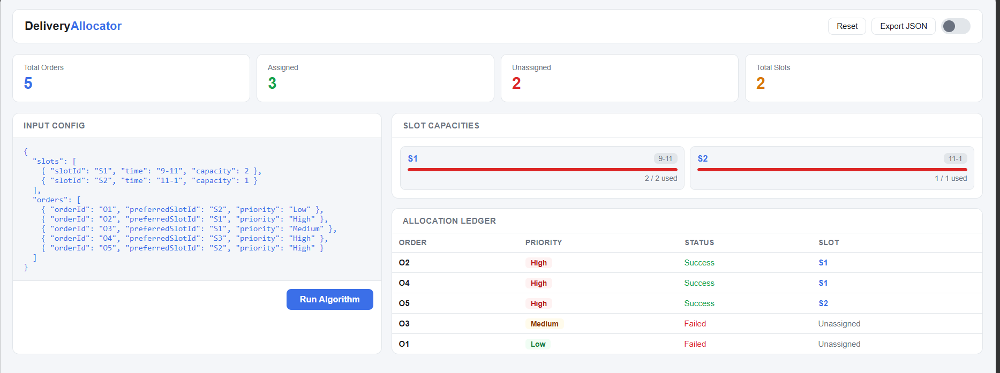

#  Smart Delivery Allocation Engine

A full-stack web application that intelligently assigns delivery orders to time slots based on priority and capacity constraints — built with Node.js, Express, and vanilla JavaScript.

<p align="center">
  
</p>

---

##  Features

- **Priority-based allocation** — High, Medium, and Low priority orders are processed in order
- **Preferred slot assignment** — Orders are placed in their preferred time slot when available
- **Smart fallback logic** — If a preferred slot is full, the next available slot is assigned automatically
- **Real-time dashboard** — Animated stats, slot capacity bars, and a full allocation ledger
- **JSON export** — Download allocation results as a `.json` file
- **Responsive UI** — Works on desktop and mobile

---

##  Tech Stack

| Layer | Technology |
|-------|------------|
| Backend | Node.js, Express |
| Frontend | HTML, CSS, Vanilla JS |
| Algorithm | Custom greedy allocation logic |

---

##  Project Structure

```
new/
├── public/               
│   ├── index.html
│   ├── style.css
│   └── app.js
├── allocate.js           
├── server.js             
└── package.json
```

---

## Getting Started

### Prerequisites
- [Node.js](https://nodejs.org/) v18+

### Installation

```bash
# Clone the repository
git clone https://github.com/YOUR_USERNAME/delivery-allocator.git
cd delivery-allocator

# Install dependencies
npm install

# Start the server
npm start
```

Then open your browser at **http://localhost:3000**

---

##  API

### `POST /api/allocate`

**Request Body:**
```json
{
  "slots": [
    { "slotId": "S1", "time": "9-11", "capacity": 2 },
    { "slotId": "S2", "time": "11-1", "capacity": 1 }
  ],
  "orders": [
    { "orderId": "O1", "preferredSlotId": "S2", "priority": "Low" },
    { "orderId": "O2", "preferredSlotId": "S1", "priority": "High" }
  ]
}
```

**Response:**
```json
{
  "success": true,
  "result": [
    { "orderId": "O2", "priority": "High", "assignedSlot": "S1" },
    { "orderId": "O1", "priority": "Low", "assignedSlot": "S2" }
  ]
}
```

---

##  Algorithm

1. Orders are sorted by priority — `High → Medium → Low`
2. Each order is first checked against its preferred slot
3. If the preferred slot is full or invalid, the next available chronological slot is used
4. Orders that cannot be placed in any slot are marked as `Unassigned`

---

